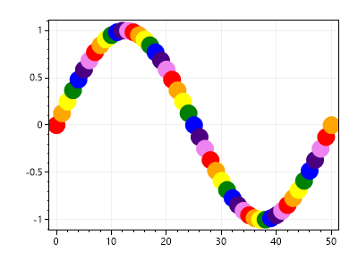
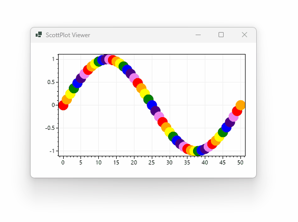

# How to Create Custom Plot Types

**ScottPlot comes with dozens of plot types (bar, scatter, pie, etc.), but users can create their own to customize styling and behavior.** ScottPlot uses the term _Plottable_ to describe objects which can be added to plots, store data, and contain logic to draw on the chart. 

* Plottables are classes that implement `IPlottable`
* Plottables store data (typically X/Y positions)
* Plottables have a `Render()` function that draws data on a `Bitmap`

## Example: Rainbow Plot

Let's create a simple custom plot type that draws circles at X/Y coordinates using rainbow colors.

```cs
using ScottPlot.Plottable;
using ScottPlotTests;
using System;
using System.Drawing;
using System.Linq;

class RainbowPlot : IPlottable
{
    double[] Xs { get; }
    double[] Ys { get; }
    Color[] Colors { get; }

    public RainbowPlot(double[] xs, double[] ys)
    {
        Xs = xs;
        Ys = ys;
        Colors = new Color[Xs.Length];

        // precalculate the color for each data point
        Color[] rainbowColors = { Color.Red, Color.Orange, Color.Yellow,
            Color.Green, Color.Blue, Color.Indigo, Color.Violet };

        for (int i = 0; i < Xs.Length; i++)
            Colors[i] = rainbowColors[i % rainbowColors.Length];
    }

    // Additional properties facilitate advanced customization
    public float Radius { get; set; } = 10;

    // These default values are fine for most cases
    public bool IsVisible { get; set; } = true;
    public int XAxisIndex { get; set; } = 0;
    public int YAxisIndex { get; set; } = 0;
    public void ValidateData(bool deep = false) { }

    // Return an empty array for plottables that do not appear in the legend
    public LegendItem[] GetLegendItems() 
        => Array.Empty<LegendItem>(); 

    // This method returns the bounds of the data
    public AxisLimits GetAxisLimits() =>
        new AxisLimits(Xs.Min(), Xs.Max(), Ys.Min(), Ys.Max());

    // This method describes how to plot the data on the cart.
    public void Render(PlotDimensions dims, System.Drawing.Bitmap bmp, bool lowQuality = false)
    {
        // Use ScottPlot's GDI helper functions to create System.Drawing objects
        using var gfx = ScottPlot.Drawing.GDI.Graphics(bmp, dims, lowQuality);
        using var brush = (SolidBrush)ScottPlot.Drawing.GDI.Brush(Color.Black);

        // Render data by drawing on the Graphics object
        for (int i = 0; i < Xs.Length; i++)
        {
            // Use 'dims' methods to convert between axis coordinates and pixel positions
            float xPixel = dims.GetPixelX(Xs[i]);
            float yPixel = dims.GetPixelY(Ys[i]);

            brush.Color = Colors[i];
            gfx.FillEllipse(brush,
                x: xPixel - Radius,
                y: yPixel - Radius,
                width: Radius * 2,
                height: Radius * 2);
        }
    }
}
```

## Console Demo

Instantiate the custom plottable and add it to a plot:

```cs
double[] xs = ScottPlot.Generate.Consecutive(51);
double[] ys = ScottPlot.Generate.Sin(51);
RainbowPlot myPlottable = new(xs, ys);

ScottPlot.Plot plt = new(400, 300);
plt.Add(myPlottable);
plt.SaveFig("plot.png");
```



## WinForms Demo

Instantiate the custom plottable and add it to a plot:

```cs
double[] xs = ScottPlot.Generate.Consecutive(51);
double[] ys = ScottPlot.Generate.Sin(51);
RainbowPlot myPlottable = new(xs, ys);

formsPlot1.Plot.Add(myPlottable);
formsPlot1.Refresh();
```



## Mouse Interactivity

Common mouse interactions can be achieved by implementing additional interfaces. To demonstrate, let's implement `IDraggable` to allow the points in this custom plot type to be dragged and dropped by with the mouse. 

```cs
class RainbowPlot : IPlottable, IDraggable
```

This is the extra code added to implement this functionality:

```cs
public bool DragEnabled { get; set; } = true;

public ScottPlot.Cursor DragCursor => ScottPlot.Cursor.Hand;

public ISnap2D DragSnap { get; set; } = new NoSnap2D();

public event EventHandler Dragged = delegate { };

private int IndexUnderMouse;

public bool IsUnderMouse(double coordinateX, double coordinateY, double snapX, double snapY)
{
    double distanceThreshold = .25;
    for (int i = 0; i < Xs.Length; i++)
    {
        double dx = Xs[i] - coordinateX;
        double dy = Ys[i] - coordinateY;
        double distance = Math.Sqrt(dx * dx + dy * dy);
        if (distance < distanceThreshold)
        {
            IndexUnderMouse = i;
            return true;
        }
    }

    return false;
}

public void DragTo(double coordinateX, double coordinateY, bool fixedSize)
{
    Xs[IndexUnderMouse] = coordinateX;
    Ys[IndexUnderMouse] = coordinateY;
}
```


## Learn More by Reviewing Official Plot Types

Learn more about how plottables are commonly constructed by inspecting the code behind the simplest plot types distributed with ScottPlot:

* [ArrowCoordinated.cs](https://github.com/ScottPlot/ScottPlot/blob/main/src/ScottPlot4/ScottPlot/Plottable/ArrowCoordinated.cs)
* [Bracket.cs](https://github.com/ScottPlot/ScottPlot/blob/main/src/ScottPlot4/ScottPlot/Plottable/Bracket.cs)
* [ScaleBar.cs](https://github.com/ScottPlot/ScottPlot/blob/main/src/ScottPlot4/ScottPlot/Plottable/ScaleBar.cs)
* [Text.cs](https://github.com/ScottPlot/ScottPlot/blob/main/src/ScottPlot4/ScottPlot/Plottable/Text.cs)

Other interfaces in the [`ScottPlot.Plottable` namespace](https://github.com/ScottPlot/ScottPlot/tree/main/src/ScottPlot4/ScottPlot/Plottable) give plottables extra functionality, such as appearing in the legend, or drag/drop mouse interactivity. 

You don't need to implement any of these additional interfaces to get started, but advanced users will benefit from knowing they exist. The purpose of all interfaces are described by XML comments.

## Source Code for this Demo

* [DemoApp.csproj](DemoApp/DemoApp.csproj)
* [Program.cs](DemoApp/Program.cs)
