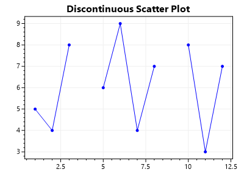

# Plot Data Containing Gaps

**ScottPlot's Scatter and Signal plots require that data is continuous and does not contain gaps.** To give the appearance of a plot where the data has gaps, users must create an individual plot for each continuous segment of the data. We recognize this requires effort on behalf of the developer, but this design allows ScottPlot to remain maximally performant.


<div class="text-center">



</div>

* [**Download this example project**](https://github.com/ScottPlot/Website/tree/main/src/faq/data-gaps/src/)

```cs
var plt = new ScottPlot.Plot(400, 300);

// first segment
double[] xs1 = { 1, 2, 3 };
double[] ys1 = { 5, 4, 8 };
plt.AddScatter(xs1, ys1, Color.Blue);

// second segment
double[] xs2 = { 5, 6, 7, 8 };
double[] ys2 = { 6, 9, 4, 7 };
plt.AddScatter(xs2, ys2, Color.Blue);

// third segment
double[] xs3 = { 10, 11, 12 };
double[] ys3 = { 8, 3, 7 };
plt.AddScatter(xs3, ys3, Color.Blue);

plt.Title("Discontinuous Scatter Plot");
plt.SaveFig("demo.png");
```