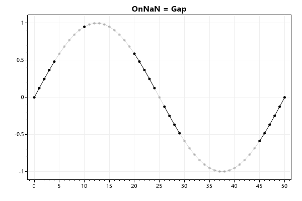

## Scatter Plots Support Gaps with NaN

Users can place `NaN` inside the data arrays of scatter plots to simulate missing data. The `OnNaN` field must be set to `Gap` to add NaN support and prevent runtime exceptions. See the [ScottPlot, NaN, and Infinity](../nan) page for additional information.



```cs
var plt = new ScottPlot.Plot(600, 400);
var scatter1 = plt.AddScatter(xs, ys, Color.Gray);
var scatter2 = plt.AddScatter(xs, ysWithNan, Color.Black);
scatter2.OnNaN = ScottPlot.Plottable.ScatterPlot.NanBehavior.Gap;
```

## Signal Plots

Signal plots do not support presenting data with gaps at this time.

To plot discontinuous signals, call `AddSignal()` multiple times.