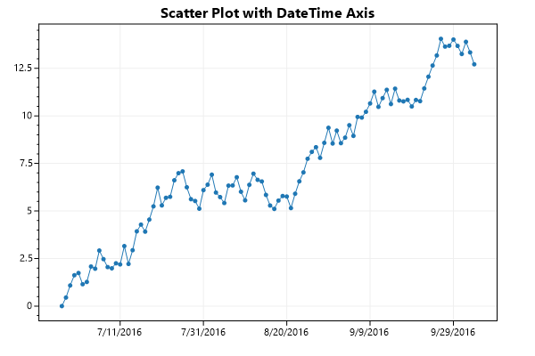
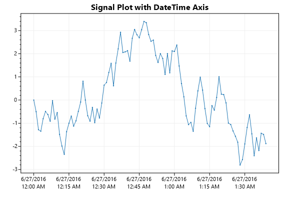

# How to plot data on a DateTime axis

**C# can represent time with the `DateTime` type, but all of ScottPlot's methods prefer `double` arrays.** This page reviews how to plot data with a time axis using ScottPlot.

**💡 TLDR:** Convert `DateTime` to `double` using `DateTime.ToOATime()` before plotting, then call `XAxis.DateTimeFormat(true)` to display axis tick labels in the proper format.

## Scatter Plot

* If time points are not evenly spaced, the Scatter Plot should be used (otherwise a Signal plot should be considered).
* Use LINQ and `DateTime.ToOATime()` to convert `DateTime[]` to `double[]` before plotting
* Call `XAxis.DateTimeFormat(true)` to indicate axis tick labels should be formatted as `DateTime` values (instead of the default numeric format)

```cs
// generate sample data (arrays of individual DateTimes and values)
int pointCount = 100;
Random rand = new Random(0);
double[] values = ScottPlot.DataGen.RandomWalk(rand, pointCount);
DateTime[] dates = Enumerable.Range(0, pointCount)
                              .Select(x => new DateTime(2016, 06, 27).AddDays(x))
                              .ToArray();

// use LINQ and DateTime.ToOADate() to convert DateTime[] to double[]
double[] xs = dates.Select(x => x.ToOADate()).ToArray();

// plot the double arrays using a traditional scatter plot
var plt = new ScottPlot.Plot(600, 400);
plt.AddScatter(xs, values);

// indicate the horizontal axis tick labels should display DateTime units
plt.XAxis.DateTimeFormat(true);

// add padding to the right to prevent long dates from flowing off the figure
plt.YAxis2.SetSizeLimit(min: 40);

// save the output
plt.Title("Scatter Plot with DateTime Axis");
plt.SaveFig("../../../datetime-scatter.png");
```



_Source code for this application is [available on GitHub](https://github.com/ScottPlot/Website/tree/main/src/faq/datetime/src/)_

## Signal Plot

* Signal plots offer a huge performance increase over Scatter Plots
* Signal plots calculate X position from `sample rate` and `offset`
* The value of `sample rate` is the number of samples per day:
  * daily: `sampleRate = 1`
  * hourly: `sampleRate = 24`
  * minute: `sampleRate = 24 * 60`
  * second: `sampleRate = 24 * 60 * 60`
  * millisecond: `sampleRate = 24 * 60 * 60 * 1000`

```cs
// generate sample data (array of values with a single starting DateTime)
int pointCount = 100;
Random rand = new Random(1);
double[] values = ScottPlot.DataGen.RandomWalk(rand, pointCount);
DateTime firstDay = new DateTime(2016, 06, 27);
double samplesPerDay = (24 * 60); // one sample per minute

// plot the double arrays using a traditional scatter plot
var plt = new ScottPlot.Plot(600, 400);
var sig = plt.AddSignal(values, sampleRate: samplesPerDay);
sig.OffsetX = firstDay.ToOADate();

// indicate the horizontal axis tick labels should display DateTime units
plt.XAxis.DateTimeFormat(true);

// add padding to the right to prevent long dates from flowing off the figure
plt.YAxis2.SetSizeLimit(min: 40);

// save the output
plt.Title("Signal Plot with DateTime Axis");
plt.SaveFig("../../../datetime-signal.png");
```



## Notes

* 👉 The ScottPlot Cookbook has additional information and code examples demonstrating advanced DateTime tick label functionality

* Axes have additional options for tick formatting, including the ability to define format strings for the date-to-string conversion, as well as the ability to indicate which culture to use (e.g., different cultures periods, hyphens, or dashes to separate month and year).