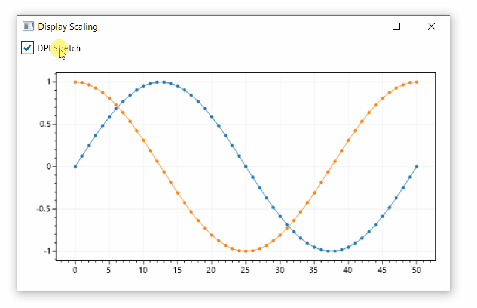

# Display Scaling

Display scaling (DPI scaling) is a setting that allows the operating system to stretch a window to be larger than its original size. When a ScottPlot control is in a scaled window it could perform one of the following behaviors:

* **Stretch:** The plot image (a bitmap) can be stretched larger, but this may result in blurry text.

* **Scale:** The plot could increase in size (width and height), but this may result in small text.

Which behavior is used can be defined using the `Configuration` module in each ScottPlot control:

```cs
WpfPlot1.Configuration.DpiStretch = true; // blurry text
WpfPlot1.Configuration.DpiStretch = false; // small text
```

<div class='text-center'>



</div>

## Increase Text Size

**Users who want sharp _and_ large text** can disable DPI stretching and increase the size of all the fonts and lines so the plot does not appear too small. An example of this is in the [ScottPlot Cookbook](/cookbook).

<div class='text-center'>


</div>