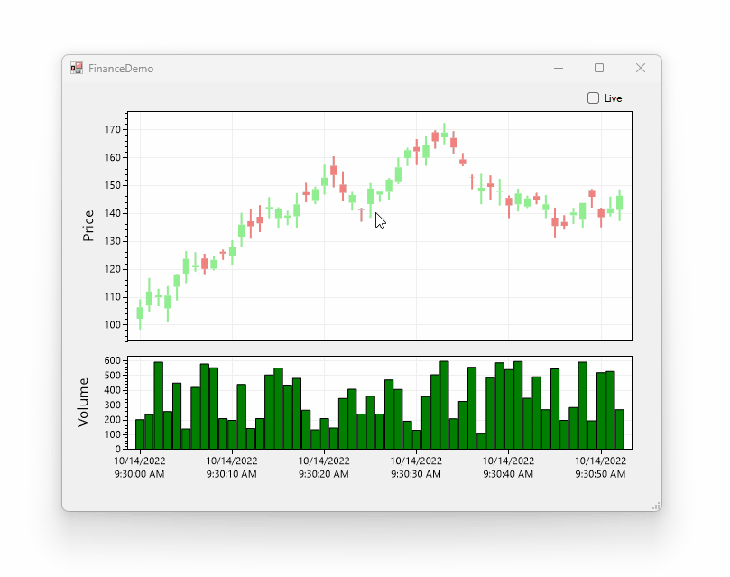

Finance charts often display price action next to volume indicators. This page describes how to synchronize two plot controls so they share a horizontal axis and can be used to simultaneously display price and volume.



### Key Concepts

* Add two plots: One for candlesticks, and another for volume
* Create a [candlestick chart](https://scottplot.net/cookbook/4.1/category/plottable-finance/) and add it to the top plot
* Create a [bar chart](https://scottplot.net/cookbook/4.1/category/plottable-bar-graph/) and add it to the bottom plot
* Use the top plot's `AxesChanged` event to update the lower plot's axes as the top plot is panned/zoomed

Note that horizontal axis units are [OATime](https://learn.microsoft.com/en-us/dotnet/api/system.datetime.tooadate?view=net-6.0) units (one day is `1.0`), so one hour is `1.0/34`, etc. OHLC objects and bar charts must be placed on the horizontal axis using these units as described by [Cookbook: Plotting DateTime Data](https://scottplot.net/cookbook/4.1/category/axis-and-ticks/#plotting-datetime-data)

### Example Code

Note that the full code for this project can be viewed here: [FinanceDemo.cs](https://github.com/ScottPlot/ScottPlot/blob/main/src/ScottPlot4/ScottPlot.Demo/ScottPlot.Demo.WinForms/WinFormsDemos/FinanceDemo.cs)

```cs
public partial class FinanceDemo : Form
{
    readonly ScottPlot.Plottable.FinancePlot CandlePlot;
    readonly ScottPlot.Plottable.BarPlot BarPlot;
    readonly Random Rand = new Random(0);

    public FinanceDemo()
    {
        InitializeComponent();

        // setup and style the candlestick
        CandlePlot = new Plottable.FinancePlot() { Candle = true };
        formsPlot1.Plot.Add(CandlePlot);
        formsPlot1.Plot.YLabel("Price");
        formsPlot1.Plot.XAxis.DateTimeFormat(true);
        formsPlot1.Plot.XAxis.Ticks(false);
        formsPlot1.Plot.XAxis.SetSizeLimit(max: 0);
        formsPlot1.AxesChanged += FormsPlot1_AxesChanged; // update plot 2 when plot 1 changes

        double[] xs = { 1, 2, 3 };
        double[] ys = { 1, 2, 3 };
        BarPlot = new Plottable.BarPlot(xs, ys, null, null);

        formsPlot2.Plot.Add(BarPlot);
        formsPlot2.Plot.YLabel("Volume");
        formsPlot2.Plot.XAxis.DateTimeFormat(true);
        formsPlot2.Plot.XAxis2.SetSizeLimit(max: 0);

        for (int i = 0; i < 100; i++)
            AddNewDataPoint();
    }

    private void AddNewDataPoint()
    {
        // generate the next random price (open/high/low/close)
        double lastClose = CandlePlot.OHLCs.Any() ? CandlePlot.OHLCs.Last().Close : 100;
        double open = lastClose + (Rand.NextDouble() - .5) * 10;
        double close = open + (Rand.NextDouble() - .4) * 10;
        double low = Math.Min(open, close) - Rand.NextDouble() * 5;
        double high = Math.Max(open, close) + Rand.NextDouble() * 5;
        double volume = Rand.NextDouble() * 500 + 100;
        TimeSpan span = TimeSpan.FromSeconds(1);
        DateTime date = CandlePlot.OHLCs.Any() 
            ? CandlePlot.OHLCs.Last().DateTime + span 
            : DateTime.Today + TimeSpan.FromHours(9.5);
        OHLC ohlc = new OHLC(open, high, low, close, date, span, volume);
        CandlePlot.Add(ohlc);

        // Automatic set axis limits to show all candles
        formsPlot1.Plot.AxisAuto();

        // Update data for the volume plot
        BarPlot.Replace(
            positions: CandlePlot.OHLCs.Select(x => x.DateTime.ToOADate()).ToArray(),
            values: CandlePlot.OHLCs.Select(x => x.Volume).ToArray());

        // Set the width of each volume bar to that of the time span.
        // Note that units are Microsoft's OATime units which are fractions of a day.
        BarPlot.BarWidth = .9 * span.TotalSeconds / TimeSpan.FromDays(1).TotalSeconds;

        // Automatic set axis limits to show all bars
        formsPlot2.Plot.AxisAuto();
        formsPlot2.Plot.SetAxisLimits(yMin: 0);
    }

    private void FormsPlot1_AxesChanged(object sender, EventArgs e)
    {
        // whenever the price plot axis limits change, set the volume axis limits to match it
        formsPlot2.Plot.MatchAxis(formsPlot1.Plot, horizontal: true, vertical: false);
        formsPlot2.Plot.MatchLayout(formsPlot1.Plot, horizontal: true, vertical: false);
        formsPlot2.Refresh();
    }
}
```