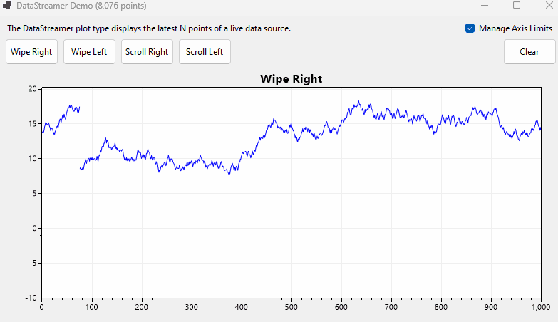
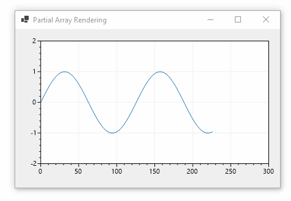

## Use the `DataLogger` to show growing datasets

The DataLogger plot type is a like a scatter plot but it has features for recording and displaying growing datasets.

* It displays points (X/Y pairs)
* It grows infinitely and old data is not deleted
* Views include: 
    * `full` - continuously shows all data
    * `slide` - focuses on latest data, continuous smooth scrolling
    * `jump` - focuses on latest data, moving view only when new data goes off the screen
* See a working example in the WinForms demo application
  * download: https://scottplot.net/demo/
  * source code: [DataStreamer.cs](https://github.com/ScottPlot/ScottPlot/blob/main/src/ScottPlot4/ScottPlot.Demo/ScottPlot.Demo.WinForms/WinFormsDemos/DataStreamer.cs)


## Use the `DataStreamer` to show the latest N values

The DataStreamer plot type is a like a signal plot but it has features for displaying the latest N values of a streaming dataset.

* It displays evenly spaced Y values
* New data overwrites old data using a circular buffer.
* Views include:
  * `wipe` - new data overlaps old data (like an ECG machine)
  * `scroll` - shifts data in one side and out the other
* See a working example in the WinForms demo application
  * download: https://scottplot.net/demo/
  * source code: [DataLogger.cs](https://github.com/ScottPlot/ScottPlot/blob/main/src/ScottPlot4/ScottPlot.Demo/ScottPlot.Demo.WinForms/WinFormsDemos/DataLogger.cs)



## Growing Data with ScatterPlotList

The `ScatterPlotList` plot type uses `List<double>` instead of `double[]` to store data, so it is easy to `Add()` data to. Actually, it supports `<T>` so you can create one using any data type that can be converted to a `double`. After adding new data the user can set the axis limits as desired and request a render. Scatter plots are slow for large datasets, so the Signal plot methods described above are almost always preferred.

See the Cookbook for examples: 
* https://scottplot.net/cookbook/4.1/category/plottable-scatter-plot-list/

## Manually Updating Data in Live Plots

**To achieve full control over changing datasets** users can use a scatter or signal plot and change their data values as new data is available. The following information discusses pros and cons of the different methods to achieve this effect:

1. **After you plot an array, you can continue to modify its values.** For example, if you load an array into a Signal plot you can continue to modify that array's values after it has been plotted. Whenever the plot renders again, the latest values will appear on the plot. This is the best option for fixed-length datasets and it is always thread safe.

2. **Call `Render()` after modifying data.** Rendering the plot can be costly, so it is not called automatically when data is modified. You control when you update data, and you control when renders occur by calling the user control's `Render()` method. For plots which update data at a high frequency it may be wise to trigger renders using a timer to achieve an acceptable frame rate instead of forcing renders to occur every time the data is modified.

3. **Adjust axis limits to accommodate new data.** If you add new data and request a render it is possible that the new data will run off the plot area. You probably want to adjust the axis limits as new data is added to ensure new data stays in the plot area. `AxisAuto()` could be used to automatically set axis limits to the boundaries of the latest data, but this method call is not performant for large datasets, calling it too frequently is jarring for users who wish to use the mouse to adjust the zooming and panning, and ever-changing axis limits can be confusing for the user. Consider implementing something custom, such as detecting when the latest data point runs outside the data area, and only then adjusting the axis limits by setting the right axis limit to the current span of the data plus 20%. This will ensure the newest data is always on the screen and minimizes the number of times the axis limits change.

4. **In multi-threaded environments** use `RenderLock()` to ensure you do not modify the length of data arrays in a Plottable while it is actively rendering. Since rendering iterates through every value in an array, changing the length of that array mid-render can produce array index exceptions. This is typically not a concern in single-thread GUI applications (WinForms), but can arise as an issue when multi-threading is used (WPF).

## Scatter Plot: Change Values in Fixed-Length Arrays

**After plotting an array you can change its values and re-render at any time.** This is the most performant option for displaying changing fixed-length data. Although this same method can be used for most plot types, Signal plots are almost always the most performant option.

<div class="text-center">


</div>

* **Full source code is on GitHub: [ChangingFixedSignal](https://github.com/ScottPlot/ScottPlot.NET/tree/main/content/faq/live-data/src/ChangingFixedSignal-WinForms)**

In this example a fixed-length `readonly` array is created and added to the plot, then a `Timer` calls a method to change the values inside that array and re-render the plot.

```cs
readonly double[] Values = new double[25];
readonly Stopwatch Stopwatch = Stopwatch.StartNew();

public Form1()
{
    InitializeComponent();
    UpdateValues();
    formsPlot1.Plot.AddSignal(Values);
}

public void UpdateValues()
{
    double phase = Stopwatch.Elapsed.TotalSeconds;
    double multiplier = 2 * Math.PI / Values.Length;
    for (int i = 0; i < Values.Length; i++)
        Values[i] = Math.Sin(i * multiplier + phase);
}

private void timer1_Tick(object sender, EventArgs e)
{
    UpdateValues();
    formsPlot1.Render();
}
```

## Scatter Plot: Rolling Effect

An alternative way to display data is to update a single point at a time, and when the data runs off the screen "roll" it back to the start. This is similar to how an oscilloscope displays a waveform, and sometimes is described as a circular buffer.

In this example a single scatter plot is created with a fixed-length array. New values are added at a position tracked by `NextIndex`, and when that position becomes larger than the array it rolls over to zero. To make this more obvious a vertical line is often added at the roll point to make it more obvious where the break occurs.

<div class="text-center">


</div>

* **Full source code is on GitHub: [RollFixedSignal](https://github.com/ScottPlot/ScottPlot.NET/tree/main/content/faq/live-data/src/RollFixedSignal-WinForms)**

```cs
readonly double[] Values = new double[500];
readonly Stopwatch Stopwatch = Stopwatch.StartNew();
readonly ScottPlot.Plottable.VLine VerticalLine;
int NextIndex = 0;

public Form1()
{
    InitializeComponent();
    formsPlot1.Plot.AddSignal(Values);
    VerticalLine = formsPlot1.Plot.AddVerticalLine(0, Color.Red, 2);
    formsPlot1.Plot.SetAxisLimits(0, Values.Length, -2, 2);
}

public void AddDataPoint()
{
    Values[NextIndex] = Math.Sin(Stopwatch.Elapsed.TotalSeconds * 3);

    NextIndex += 1;
    if (NextIndex >= Values.Length)
        NextIndex = 0;

    VerticalLine.X = NextIndex;
}

// This timer adds data frequently (every 1 ms)
private void timer1_Tick(object sender, EventArgs e)
{
    AddDataPoint();
}

// This timer renders infrequently (every 20 ms)
private void timer2_Tick(object sender, EventArgs e)
{
    formsPlot1.Render();
}
```

## Signal Plot: Partial Array Rendering

**You can create a large array and only display the first N values, increasing N as new data is added.** This gives the illusion of a growing plot, even though its source is a fixed-length array. The range of visible values is controlled by the `MinRenderIndex` and `MaxRenderIndex` fields of Signal plots and Scatter plots.

<div class="text-center">



</div>

* **Full source code is on GitHub: [MaxRenderIndex](https://github.com/ScottPlot/ScottPlot.NET/tree/main/content/faq/live-data/src/MaxRenderIndex-WinForms)**

```cs
readonly double[] Values = new double[100_000];
readonly ScottPlot.Plottable.SignalPlot SignalPlot;
int NextPointIndex = 0;

public Form1()
{
    InitializeComponent();
    SignalPlot = formsPlot1.Plot.AddSignal(Values);
    formsPlot1.Plot.SetAxisLimits(0, 100, -2, 2);
}

// This timer adds data frequently (1000 times / second)
private void timer1_Tick(object sender, EventArgs e)
{
    Values[NextPointIndex] = Math.Sin(NextPointIndex * .05);
    SignalPlot.MaxRenderIndex = NextPointIndex;
    NextPointIndex += 1;
}

// This timer renders infrequently (10 times per second)
private void timer2_Tick(object sender, EventArgs e)
{
    // adjust the axis limits only when needed
    double currentRightEdge = formsPlot1.Plot.GetAxisLimits().XMax;
    if (NextPointIndex > currentRightEdge)
        formsPlot1.Plot.SetAxisLimits(xMax: currentRightEdge + 100);

    formsPlot1.Render();
}
```

**⚠️ WARNING: This example will crash when the array is full.** To prevent this, detect when `NextPointIndex` equals or exceeds the size of the array, and create a new larger array to hold the data. When you do this you will have to copy all the existing values from the old array to the new one.
