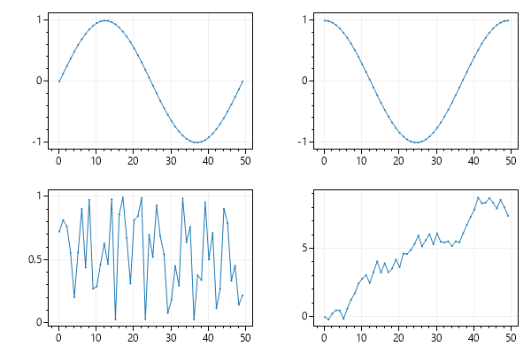
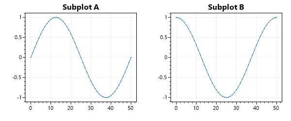

# MultiPlot

A _MultiPlot_ is a single image that contains multiple plots.

<div class="text-center">



</div>

## Static Image MultiPlot

* To create a single image with multiple plots, render each plot as a `Bitmap`, then render each `Bitmap` onto a large image.

```cs
// render subplot A as a Bitmap
var plt1 = new ScottPlot.Plot(300, 250);
plt1.AddSignal(ScottPlot.DataGen.Sin(51));
plt1.Title("Subplot A");
System.Drawing.Bitmap bmp1 = plt1.Render();

// render subplot B as a Bitmap
var plt2 = new ScottPlot.Plot(300, 250);
plt2.AddSignal(ScottPlot.DataGen.Cos(51));
plt2.Title("Subplot B");
System.Drawing.Bitmap bmp2 = plt2.Render();

// combine Bitmaps into one large Bitmap
using (var bmp = new System.Drawing.Bitmap(600, 250))
using (var gfx = System.Drawing.Graphics.FromImage(bmp))
{
    gfx.DrawImage(bmp1, 0, 0);
    gfx.DrawImage(bmp2, 300, 0);
    bmp.Save("MultiPlot.bmp");
}
```

<div class="text-center">



</div>

## User Control MultiPlot

* To create a window with multiple plots, add multiple user controls to the plot. For example, a WinForms Application with 4 plots can be achieved by adding 4 `FormsPlot` controls to the Form.

* To connect axes between multiple plots (so panning one subplot pans them all), use the `OnAxesChanged` event to update the axes for all controls whenever the axis of one changes. This technique is further described on the [shared axes FAQ page](../shared-axes).

<div class="text-center">


</div>

## Obsolete MultiPlot Class

Legacy versions of ScottPlot had a `MultiPlot` class which could load several `Plot` objects in a grid layout. When a render was requested, the `MultiPlot` rendered each `Plot` as a `Bitmap` then stitched all the images together to form one large image. This method is identical to that described above, it was just packed into a class. The problem with this design is that (1) it only supported grid layouts and (2) its behavior differed so much from the user controls that it frequently confused users. For these reasons the MultiPlot module was deprecated, and users are required to implement their own multi-plot arrangements using the methods described above.

See https://github.com/ScottPlot/ScottPlot/discussions/1280 for an example of how to recreate multiplot functionality without the `MultiPlot` module.