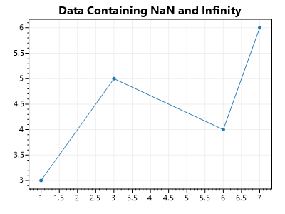

# Data Containing `NaN`

It is possible to place these numbers inside `double[]` arrays:
* `Double.PositiveInfinity`
* `Double.NegativeInfinity`
* `Double.NaN`. 

**⚠️ Do not plot data containing these values!** 

All values to be plotted must be translatable into pixel coordinates, and these special floating-point values cannot be rendered. Attempting to plot data containing these values may cause rendering artifacts, unexpected axis limit detection problems, and exceptions during rendering.

## Isolate Finite Points with LINQ

Users can use LINQ to create a new array containing only finite/plottable data points, then plot those.

<div class="text-center">



</div>

* [**Download this example project**](https://github.com/ScottPlot/Website/tree/main/src/faq/nan/src/)

```cs
var plt = new ScottPlot.Plot(400, 300);

// create original data with unplottable values
double[] originalYs = { 3, double.NaN, 5, double.PositiveInfinity, double.NegativeInfinity, 4, 6 };
double[] originalXs = { 1, 2, 3, 4, 5, 6, 7 };

// Attempting to plot these arrays would throw an exception at render time
//plt.AddScatter(originalXs, originalYs);

// isolate and plot real data values
var plottableIndexes =
    Enumerable
    .Range(0, originalYs.Length)
    .Where(i => !double.IsNaN(originalYs[i]))
    .Where(i => !double.IsInfinity(originalYs[i]));
double[] plottableXs = plottableIndexes.Select(i => originalXs[i]).ToArray();
double[] plottableYs = plottableIndexes.Select(i => originalYs[i]).ToArray();
plt.AddScatter(plottableXs, plottableYs);

plt.Title("Data Containing NaN and Infinity");
plt.SaveFig("output.png");
```