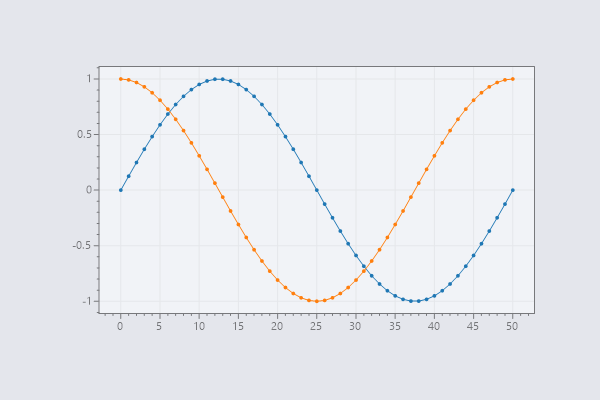
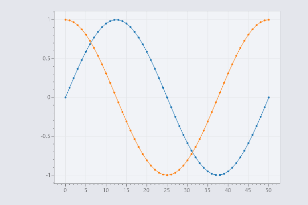
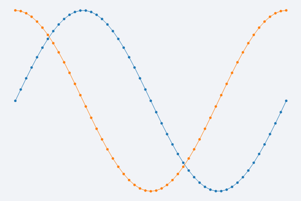
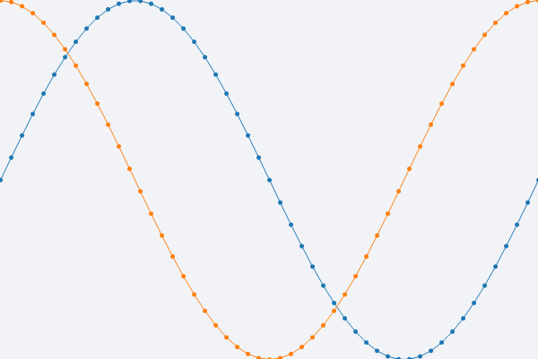

# Custom Padding and Frameless Plots

* **Padding** is the empty space between the axis (ticks and labels) and the edge of the figure.
  * Special axis tick labels that are very large or angled may require the user to increase the **padding**.
  * Adjust padding using the `Layout()` method
* **Margin** is the distance between the edge of the data and the edge of the data area.
  * Adjust margin using the `AxisAuto()` method
  * By default the data is slightly padded to give a floating appearance on all sides.
  * When the margin is set to zero, the data touches the data area on all sides.

**💡 TLDR:** Use `Layout()` to adjust padding around the figure and `AxisAuto()` to adjust margin around the data.

Examples on this page follow this common start-up sequence:

```cs
var plt = new ScottPlot.Plot(600, 400);
plt.AddSignal(ScottPlot.DataGen.Sin(51));
plt.AddSignal(ScottPlot.DataGen.Cos(51));
plt.Style(ScottPlot.Style.Light2);
```

## Default Padding

The default behavior is to size every axis according to its contents (the largest tick label and the axis label if it is visible) with 5 px of padding by default.

```cs
plt.SaveFig("padding-default.png");
```


## Customize Padding for All Axes

You can increase the amount of padding (in pixels) around all axes:

```cs
plt.Layout(padding: 50);
plt.SaveFig("padding-custom.png");
```



## Adjust Padding for Individual Axes

Each axis has a _minimum size_ it will maintain even if its contents are smaller than this. One way to give the appearance of padding is to manually define this minimum size (increasing it for the axis you want to pad).

This is typically done to add padding on the right side of the graph (by increasing the minimum size of the `YAxis2` axis) to accommodate large horizontal axis tick labels (like dates).

```cs
plt.Layout(left: 100, right: 50, bottom: 10, top: 10);
plt.SaveFig("padding-defined.png");
```



## Frameless Plot

To give the appearance of a frameless plot, set the axis size for all axes to zero, hide all axes (ticks, tick labels, and axis labels), and hide the frame (the square outline around the data area). All these tasks can be accomplished using the `Frameless()` shortcut.

```cs
plt.Frameless();
plt.SaveFig("padding-none.png");
```



## Frameless Plot Without Data Padding

Frameless plots are often used in conjunction with very tight axes so the data appears to touch the edge of the figure. Use `AxisAuto(0, 0)` to automatically adjust the axes to fit the data with zero margin (padding) around it.

```cs
plt.Frameless();
plt.AxisAuto(0, 0);
plt.SaveFig("padding-none-tight.png");
```

