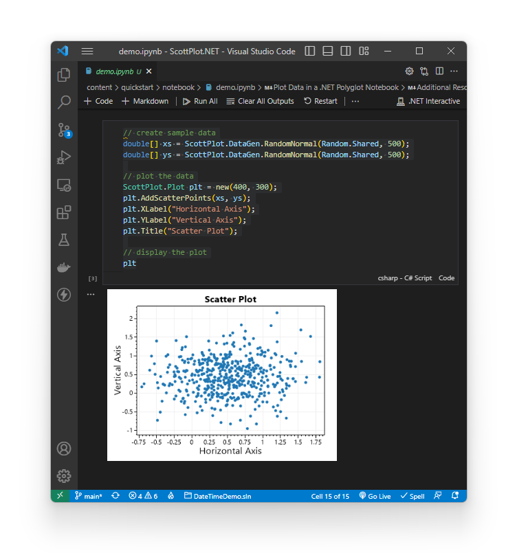

.NET Interactive Notebooks (polyglot notebooks) allow programmers to work with data in an interactive environment. To get started using ScottPlot to display data in a .NET notebook, 

### Create a new .NET Notebook

* Install [VS Code](https://code.visualstudio.com/)
* Install the VS Code [Polyglot Notebooks extension](https://marketplace.visualstudio.com/items?itemName=ms-dotnettools.dotnet-interactive-vscode)
* Press `CTRL + SHIFT + P` to open the command dialogue
* Select _Polyglot Notebook: Create Default Notebook_
* Choose the `.ipynb` extension and select the C# language

### Setup ScottPlot

Add this to the top of your notebook to use the ScottPlot NuGet package and make it easy to display plots inline:

```cs
// Install the ScottPlot NuGet package
#r "nuget:ScottPlot, 4.1.*"

// Setup a custom formatter to display plots as images
using Microsoft.DotNet.Interactive.Formatting;
Formatter.Register(typeof(ScottPlot.Plot), (p, w) => 
    w.Write(((ScottPlot.Plot)p).GetImageHtml()), HtmlFormatter.MimeType);
```

### Plot Data

```cs
// create sample data
double[] dataX = new double[] { 1, 2, 3, 4, 5 };
double[] dataY = new double[] { 1, 4, 9, 16, 25 };

// plot the data
var plt = new ScottPlot.Plot(400, 300);
plt.AddScatter(dataX, dataY);

// display the plot
plt
```


### Advanced Notebook Examples

Scatter plots, bar charts, and more are demonstrated in a notebook:

* Download: [demo.ipynb](demo.ipynb)

* View as HTML: [demo.html](demo)

[](demo)

## Resources

* [Announcing Polyglot Notebooks! Multi-language notebooks in Visual Studio Code](https://devblogs.microsoft.com/dotnet/announcing-polyglot-notebooks-harness-the-power-of-multilanguage-notebooks-in-visual-studio-code/) (March 15, 2023)

* [.NET Interactive Notebooks is now Polyglot Notebooks!](https://devblogs.microsoft.com/dotnet/dotnet-interactive-notebooks-is-now-polyglot-notebooks/) (Nov 3, 2022)

* [Doug Finke](https://github.com/dfinke) prepared a [YouTube video](https://www.youtube.com/watch?v=nL0JRukCU4k) and [GitHub repository](https://github.com/dfinke/PowerShellScottPlot) demonstrating how to create data visualizations with PowerShell and ScottPlot in the a Polyglot Interactive Notebook.
